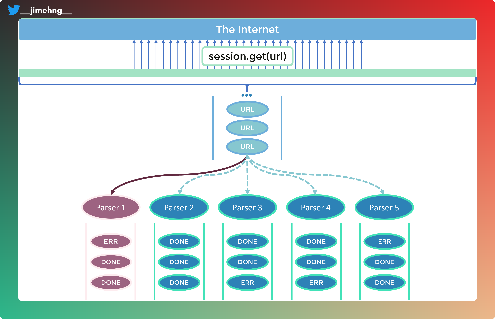

# Streamlining Data Processing with Python's AsyncIO: A Concurrent Way to Parse CSV Files from the Web


Discover the power of speed and concurrency in Python! As a data professional, you understand the importance of efficient data ingestion, validation, and transformation. Imagine being able to process hundreds or even thousands of files at lightning speed, all thanks to the power of asynchronous programming.

In this article, we'll dive into the world of concurrency and explore how to harness its potential in Python. Python, while a great language for data processing, doesn't come with built-in concurrency support. But with the help of the asyncio library, you'll learn how to write code that can double or even triple the speed of your data processes.

Rust, on the other hand, provides a built-in multi-producer-single-consumer channel, making it easy to implement concurrency in your code. Below is a code snippet that illustrates just how simple it is to use Rust's concurrency features.

```rust
use std::thread;
use std::sync::mpsc::channel;

// Create a simple streaming channel
let (tx, rx) = channel();
thread::spawn(move|| {
    tx.send(10).unwrap();
});
assert_eq!(rx.recv().unwrap(), 10);
```

Go, provides the so-called 'goroutines' and the `go` keyword which immediately execute the function followed by the keyword in a separate thread.

Don't miss out on the opportunity to improve the speed and efficiency of your data processes. Join us as we explore the power of speed and concurrency in Python!

# The Example

In this example, we'll be diving into the world of asynchronous programming in Python to improve the efficiency of data ingestion, validation, and transformation. Here's a breakdown of the process:

1. Using `aiohttp`'s `ClientSession`, we'll retrieve 32 CSV-formatted files from the Internet.
2. These files will then be placed into an `asyncio`'s `Queue` for processing.
3. We'll use 5 different parsers (synchronous python functions) to distribute the workload of parsing these 32 files.
4. To simulate a long parsing process, we'll use the `sleep` function from the `time` library.
5. Lastly, we'll use `pandas`'s `read_csv(...)` function to convert the CSV files into a `pandas`'s `DataFrame`.

With this example, you'll see how easy it is to improve the speed and efficiency of your data processes using the power of asynchronous programming in Python.



# Let's Look at the Codes

Let's take a closer look of the codes in `parsing_csv_async.py`, where we implement asynchronous parsing of CSV files. There is also a synchronous version of it, located in `parsing_csv_sync.py`.

## Listing the URLs

```
urls = [
    # Some random CSV urls from the internet
    'https://people.sc.fsu.edu/~jburkardt/data/csv/addresses.csv',
    'https://people.sc.fsu.edu/~jburkardt/data/csv/airtravel.csv',
    ...
]
```
Here, we get 32 urls from the Internet, specifically from https://people.sc.fsu.edu/, these 32 urls are CSV files that are hosted on the server.

## The Components

There are 3 components to these codes:
1. the Parser, which is a simple synchronous wrapper around the `parse_csv(...)` coroutine.
2. the `parse_csv(...)` asynchronous coroutine which is a wrapper around the `pandas`'s `read_csv(...)` function.
3. the `main()` coroutine where the main workflow resides.

## `parse_csv(...)` Asynchronous Coroutine

```python
async def parse_csv(url: str, queue: Queue, session: ClientSession, **parsing_parameters):
    try:
        with Timer(text=f"{url} -> For this url, transformation took: {{:.4f}}"):
            response = await asyncio.wait_for(session.get(url), timeout=5)
            csv = StringIO(await response.text())
            logger.info(f"Starting to parse CSV file for url={url}.")
            dataframe = pd.read_csv(csv, **parsing_parameters)
            # simulate long parsing process
            time.sleep(0.5)
            logger.info("CSV file is parsed for url={url}.")
            logger.info(f"Print out first five columns of the first row of the dataframe: {dict(dataframe.iloc[0, :5])}")
    except Exception as e:
        logging.exception(f'Error processing url {url}')
```

1. Using the `.get(...)` method of `ClientSession`, we'll send a request to the specified `url` and retrieve the `response`.
2. We'll then use the await keyword to asynchronously wait for the `text()` coroutine of the `response` object to return the contents of the file.
3. Once the contents are retrieved, we'll pass it into the constructor of `StringIO` to convert it from bytes to a String object.
4. This `String` object will then be passed into `pandas`'s `read_csv(...)` function to convert it into a `DataFrame`.
5. Any exceptions that occur during the parsing of the CSV file will be logged in the try-except block for further analysis.

With this process, we're able to retrieve and parse CSV files from the internet in an efficient and asynchronous manner, making use of the power of Python's asyncio library and aiohttp.

## Parser

```python
async def parser(parser_id: int, queue: Queue, session: ClientSession, **parsing_parameters):
   
    while True:
        url: str = await queue.get()
        logger.info(f"For parser_id={parser_id}, parsing the url={url}")
        await parse_csv(url, queue, session, **parsing_parameters)
        queue.task_done()
```

The implementation of the parser coroutine is intuitive and straightforward. To begin, we utilize a `parser_id` parameter, of type `int`, which enables us to distinguish between instances of the function and the corresponding CSV files they parse. Next, we retrieve the URL of the CSV file to be downloaded from the `asyncio.Queue`. Finally, it is crucial to signal to the `Queue` that the task has been completed upon successful parsing of the CSV file.

## `main()` Coroutine

```python
async def main():
    with Timer(text=f"With async Queue -> Entire Run took: {{:.4f}}"):
        url_queue = Queue()
        [url_queue.put_nowait(url) for url in urls]
        logger.info(f"The `url_queue` has {url_queue}")
        async with aiohttp.ClientSession() as session:
            parsers = [asyncio.create_task(parser(i, url_queue, session, encoding='utf-8'))
                    for i in range(5)]
            await url_queue.join()
            [p.cancel() for p in parsers]

if __name__ == '__main__':
    asyncio.run(main())
```

For the `main()` coroutine, we initiate by creating an instance of `asyncio.Queue` referred to as `url_queue`. Subsequently, we utilize the `put_nowait(url)` method to populate the `Queue` with the URLs we intend to parse. To facilitate monitoring and debugging, we utilize the `logging.Logger` module to log the state of the `url_queue` variable. Upon execution, the log of the `url_queue` variable should resemble the following example:

```raw
[parsing_csv_async.py]:[83] [INFO] - The `url_queue` has <Queue maxsize=0 
_queue=['https://people.sc.fsu.edu/~jburkardt/data/csv/addresses.csv', 'https://people.sc.fsu.edu/~jburkardt/data/csv/airtravel.csv', 
'https://people.sc.fsu.edu/~jburkardt/data/csv/biostats.csv', ...] tasks=32>
```

This shows that there are indeed 32 URLs waiting to be parsed in the `Queue`.

Then we use `aiohttp.ClientSession`'s context manager and its `.get(url)` method, passing each `url` of the list of `urls` into it, to download the CSV file in bytes asynchronously. Finally, we create our `parsers` which is a list of `Task` objects, using `asyncio.create_task(...)` function. The most important here is to call `url_queue.join()` method for the queue to start processing the `Task` object within.

# The Synchronous Version

The same workflow is implemented in a sequential manner, shown below:

```python
def parse_csv(url: str, **parsing_parameters):
    try:
        with Timer(text=f"{url} -> For this url, transformation took: {{:.4f}}"):
            response = requests.get(url)
            csv = StringIO(response.text)
            logger.info(f"Starting to parse CSV file for url={url}.")
            dataframe = pd.read_csv(csv, **parsing_parameters)
            # simulate long parsing process
            time.sleep(0.5)
            logger.info(f"CSV file is parsed for url={url}.")
            logger.info(f"Print out first five columns of the first row of the dataframe: {dict(dataframe.iloc[0, :5])}")
    except Exception as e:
        logging.exception(f'Error processing url {url}')


def main():
    with Timer(text=f"Normal sequential run -> Entire Run took: {{:.4f}}"):
        for url in urls:
           parse_csv(url, encoding='utf-8') 
```

It is straightforward to see that for each `url` in the list of `urls`, the `parse_csv` acts on the `url`, parsing it.

# How to Run It

We can run the program by going to the directory containing the `parsing_csv_async.py` file and then using the command below:

```raw
python -m parsing_csv_async >> parsing_async.log 2>&1
```
where we pipe the output of the run to the file `parsing_async.log`, directing the `stderr` output to `stdout`.

Likewise, for `parsing_csv_sync.py`, the command is:

```raw
python -m parsing_csv_sync >> parsing_sync.log 2>&1
```

# The Logs

A partial log after running `parsing_csv_async.py` is shown below:

```
=== SECTION A ===
[13:06:22] [parsing_csv_async.py]:[66] [INFO] - For `parser_id`=0, getting the `url`=https://people.sc.fsu.edu/~jburkardt/data/csv/addresses.csv
[13:06:22] [parsing_csv_async.py]:[66] [INFO] - For `parser_id`=1, getting the `url`=https://people.sc.fsu.edu/~jburkardt/data/csv/airtravel.csv
[13:06:22] [parsing_csv_async.py]:[66] [INFO] - For `parser_id`=2, getting the `url`=https://people.sc.fsu.edu/~jburkardt/data/csv/biostats.csv
[13:06:22] [parsing_csv_async.py]:[66] [INFO] - For `parser_id`=3, getting the `url`=https://people.sc.fsu.edu/~jburkardt/data/csv/cities.csv
[13:06:22] [parsing_csv_async.py]:[66] [INFO] - For `parser_id`=4, getting the `url`=https://people.sc.fsu.edu/~jburkardt/data/csv/crash_catalonia.csv

=== SECTION B ===
(A) -> [13:06:26] [parsing_csv_async.py]:[66] [INFO] - For `parser_id`=1, getting the `url`=https://people.sc.fsu.edu/~jburkardt/data/csv/freshman_lbs.csv
[13:06:26] [parsing_csv_async.py]:[69] [INFO] - `parser_id`=2 has started to parse CSV file for 
`url`=https://people.sc.fsu.edu/~jburkardt/data/csv/example.csv.
[13:06:27] [parsing_csv_async.py]:[73] [INFO] - `parser_id`=2 has finished parsing the CSV file for 
`url`=https://people.sc.fsu.edu/~jburkardt/data/csv/example.csv.
[13:06:27] [parsing_csv_async.py]:[74] [INFO] - Print out first five columns of the first row of the dataframe: {'TOK': 'JET', 'UPDATE': 20031201, 'DATE': 
20001006, 'SHOT': 53521, 'TIME': 10.0}
[13:06:27] [parsing_csv_async.py]:[66] [INFO] - For `parser_id`=2, getting the `url`=https://people.sc.fsu.edu/~jburkardt/data/csv/grades.csv
[13:06:27] [parsing_csv_async.py]:[69] [INFO] - `parser_id`=4 has started to parse CSV file for 
`url`=https://people.sc.fsu.edu/~jburkardt/data/csv/ford_escort.csv.

### parser_id=4 doing work...

[13:06:27] [parsing_csv_async.py]:[69] [INFO] - `parser_id`=0 has started to parse CSV file for 
`url`=https://people.sc.fsu.edu/~jburkardt/data/csv/freshman_kgs.csv

### parser_id=0 doing work...

(B) -> [13:06:28] [parsing_csv_async.py]:[66] [INFO] - For `parser_id`=1, getting the `url`=https://people.sc.fsu.edu/~jburkardt/data/csv/hurricanes.csv

```

From the log output, it is apparent that:

1. In SECTION A, all 5 parsers initiate non-blocking requests to the web server to retrieve the associated CSV files from the specified URLs.
2. In SECTION B, we can observe that while the program is waiting for the response from the non-blocking `GET` request issued by `parser_id`=1, denoted by `(A) ->` in the logs, it continues to execute the work required for `parser_id`=2, 4, and 0.
3. Once `parser_id`=1 receives the response, it proceeds to execute its subsequent tasks, as indicated by `(B) ->`.

This illustrates how the program efficiently utilizes `asyncio` to perform multiple requests simultaneously, as well as how it is able to continue executing other tasks while waiting for the response to a request.

## Here's another part of the logs on the time taken

```
In `parser_id`=1, `url`=https://people.sc.fsu.edu/~jburkardt/data/csv/airtravel.csv, transformation took: 2.1891
In `parser_id`=2, `url`=https://people.sc.fsu.edu/~jburkardt/data/csv/biostats.csv, transformation took: 2.7284
In `parser_id`=4, `url`=https://people.sc.fsu.edu/~jburkardt/data/csv/crash_catalonia.csv, transformation took: 3.2563
In `parser_id`=3, `url`=https://people.sc.fsu.edu/~jburkardt/data/csv/cities.csv, transformation took: 3.8160
In `parser_id`=0, `url`=https://people.sc.fsu.edu/~jburkardt/data/csv/addresses.csv, transformation took: 4.3319
...
With async Queue -> Entire Run took: 17.3086
```

Here we see that each 'transformation' took around 2 to 4 seconds but the entire run took only about 17s.

For synchronous run, it took about 57 seconds. This is about a 70% reduction in processing time, more than half!

# Summary

1. In this example, we have employed the use of `asyncio`'s `Queue` and `aiohttp`'s `ClientSession` to implement non-blocking, asynchronous-concurrent programming for the purpose of parsing CSV files downloaded from the Internet.
2. By utilizing the `ClientSession` for non-blocking `GET` requests, the program is able to pass control back to the caller and continue executing the rest of the program while awaiting the response from the GET request.
3. The `Queue` allows for the distribution of work across different instances of the parsing function in a sequential but non-blocking manner. This means that if there is any waiting involved within the execution of the function, control is passed back to the caller to continue execution in other instances.
4. Through the implementation of python's `asyncio` library, we were able to achieve a notable improvement in processing speed, with a reduction of more than 70% in comparison to the synchronous implementation.

# Reach Out

Do reach out to me on [LinkedIn](https://www.linkedin.com/in/soon-siang-chng/) for any discussion! The codes of this post is also available on my [GitHub](https://github.com/jymchng/iron_rust/tree/master/posts/parsing_csv_df_asyncio).