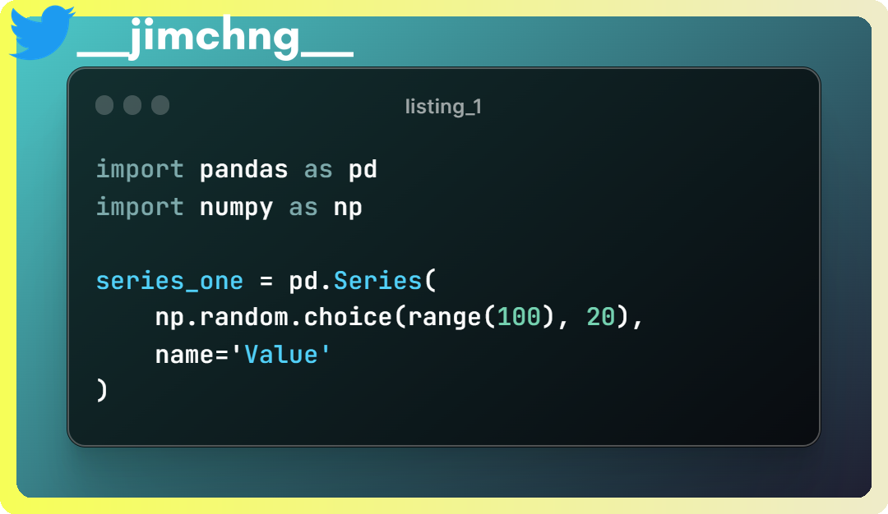
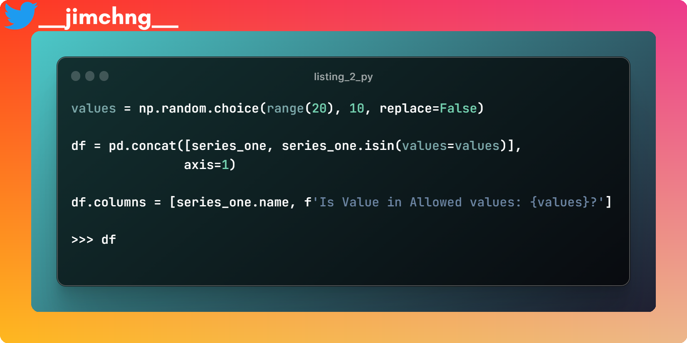
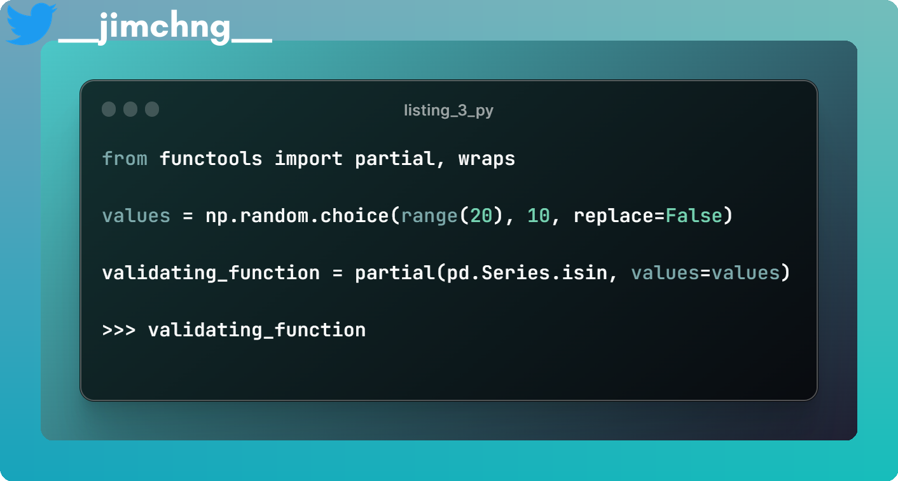
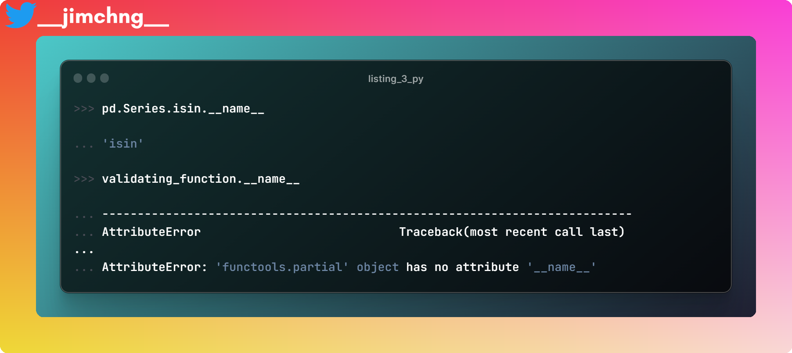
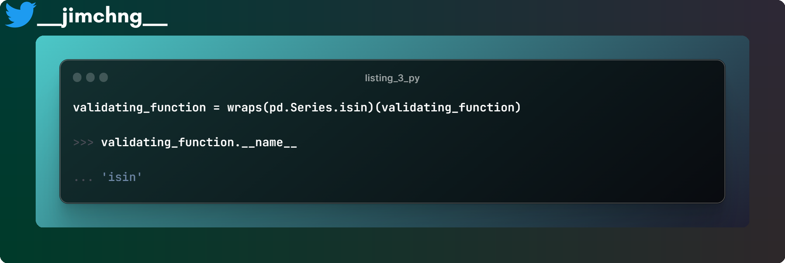

# Data Validation with pandas, with a primer to Python decorators


Whether you are a budding data scientist, an experienced data engineer or an owner of a small business, you’re bound to need to validate the integrity of your datasets.

`pandas` is a popular Python package, it enables users to manipulate datasets that are in tabled form.

You can certainly validate your dataset simply
One of the easiest ways to validate your dataset is to use pandas’ built-in APIs, such as the `pandas.Series.isin(values)`. Given a `pandas.Series`, it returns another `pandas.Series` with the same rows as the original series, where its values are of boolean type, indicating `True` if the value of the original series is in the set values and `False` otherwise.




As an example, a `pandas.Series` is generated using random numbers, 20 of them are generated from a set of possible values ranging from 0 to 100.

<div align='center'>

|    |   Value |
|---:|--------:|
|  0 |      74 |
|  1 |      28 |
|  2 |      33 |
|  3 |      12 |
|  4 |      94 |
|  5 |      27 |
|  6 |      91 |
|  7 |      59 |
|  8 |      91 |
|  9 |      29 |
| 10 |      15 |
| 11 |      75 |
| 12 |      47 |
| 13 |      92 |
| 14 |      72 |
| 15 |      54 |
| 16 |       4 |
| 17 |      39 |
| 18 |      67 |
| 19 |      30 |

</div>


Then a set of allowed values is generated randomly and the `pandas.Series.isin()` method is used to validate if the value falls within the allowed values.



<div align='center'>

|Index   |   Value | Is Value in Allowed values:<br> [ 5 11 17  0  4 19  7  3 16  8]?   |
|:---:|:--------:|:---------------------------------------------------------------:|
|  0 |      74 | False                                                          |
|  1 |      28 | False                                                          |
|  2 |      33 | False                                                          |
|  3 |      12 | False                                                          |
|  4 |      94 | False                                                          |
|  5 |      27 | False                                                          |
|  6 |      91 | False                                                          |
|  7 |      59 | False                                                          |
|  8 |      91 | False                                                          |
|  9 |      29 | False                                                          |
| 10 |      15 | False                                                          |
| 11 |      75 | False                                                          |
| 12 |      47 | False                                                          |
| 13 |      92 | False                                                          |
| 14 |      72 | False                                                          |
| 15 |      54 | False                                                          |
| 16 |       4 | True                                                           |
| 17 |      39 | False                                                          |
| 18 |      67 | False                                                          |
| 19 |      30 | False                                                          |

</div>

For a particular dataset, you may have a different set of allowed values for which the values of each different column can be. For this dataset, you may, and is certainly possible to manually write a couple of `.isin()` methods for the different columns.

# Yet…
You can easily see that this does not scale well with the number of datasets. Let’s say you have thousands of datasets, you probably won’t be writing tens of thousands of lines of codes to validate all of them.

Also, this approach works only if you know ahead of time, the validation criterion that is needed for your dataset.

Very often, you can only read from a relational table (in a form of an Excel sheet or a SQL table), to get the validation requirements during runtime, e.g. for an attribute (another name for column) for a particular dataset, this is the set of allowed values, etc.

Therefore, you would need to dynamically “fill” up the positional and/or keyword arguments of your validating function, e.g. in the previous example, to dynamically fill up the values parameter during runtime.

# Here comes the decorator!
This can be achieved by using `functools.partial` , which is a decorator.




You can read more about decorators here. Basically, a decorator is a function that eats a function and returns “another” function. 

For example: the codes in the snippet below

```python
@decorator
def print_hello():
    print("Hello to you!")
```

is equivalent to:
```
decorator(print_hello)
```

Specifically, what the ``functools.partial`` decorator does is that it allows you to dynamically fill up the positional and/or keyword arguments of the function and returns it for something else to call it.


The above example shows that the validating_function that was returned by partial with `pd.Series.isin()` as an input, remains a callable object. The function callable is called with input validating_function and returned True , affirming that it is indeed still a function (i.e. a callable).


You can then use this validating_function by calling it on a pandas.Series object and getting a boolean series as shown.


# Problem with `functools.partial`
However, there is one downside to `functools.partial` , that is all the attributes associated with your original function are lost.



As shown, the validating_function does not retain the `__name__` attribute of the original `pd.Series.isin()` method. You might want these attributes of the original function to be retained for say, to know what validating functions have acted on the dataset.

# Just one additional line to solve the issue…
To overcome this, you would need a customized `_partial` decorator. Of course, the gist below is copied from the Python documentation and added a `@wraps(func)` line.



`wraps` wrapper around a function to allow for some of its positional and keyword arguments to be dynamically filled.
Using the above decorator, whatever attributes that are associated with your original function will be retained. `pd.Series.isin()` is given a new attribute named hello and is assigned the value of string type 'how are you?' . As seen below, `validating_function` has the same attribute hello and the same value 'how are you?' .


Okay, I’m finally done writing what I intended to write! I hope you have found my sharing helpful to you! Thanks. You can get the codes in this blog in my [GitHub](https://github.com/jymchng/iron_rust/tree/master/posts/validating_df_decorators).